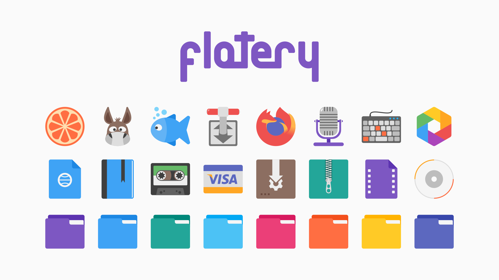
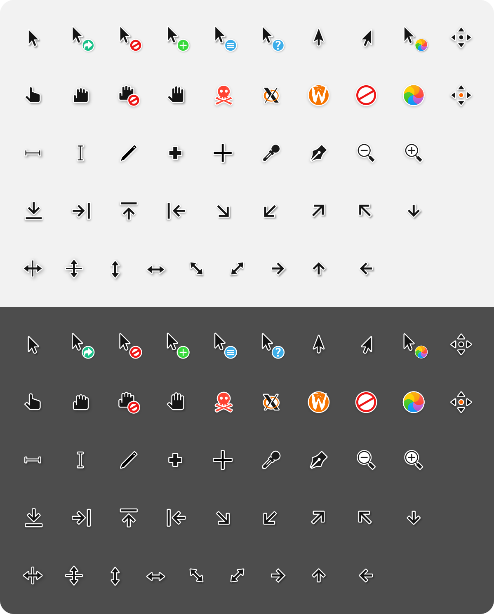
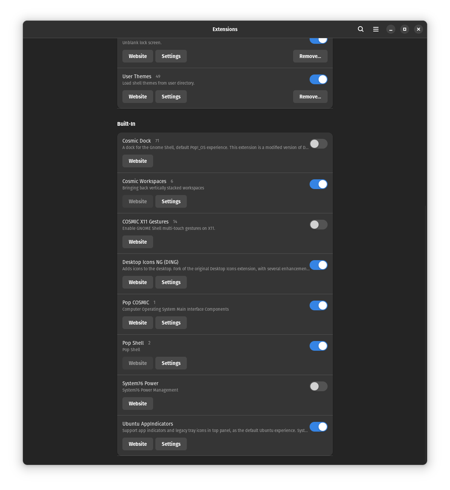

## Gnome

[Pop!_OS](./popos.md) gebruikt [Gnome](../../gnome.md) als window manager.

## Gnome extensions

1. Ga naar [https://extensions.gnome.org/](https://extensions.gnome.org/)
2. Download en installeer de Browser Extension in je browser (zie link bovenaan de pagina)
    !!! note
        The extension allows GNOME to look in  the user directory for themes and icons  
3. Click op `User Themes` en activeer deze.

## Folder creatie

Voor je van start kunt, moet je eerst 2 folders aanmaken.

1. Ga naar je home directory.
2. Maak de folders `.themes` en `.icons`.

## Dracula Theme

1. Ga naar [https://draculatheme.com](https://draculatheme.com).
2. Vul `gtk` in de zoekbalk
3. Download het zip bestand van Github
4. Drag-and-drop de folder in de zip file naar `~/.themes`
5. Hernoem de folder naar `Dracula`

## Gnome Tweaks

### Installatie gnome-tweaks

Installeer `gnome-tweaks` met `sudo apt install gnome-tweaks`

### Aanpassingen

Open `gnome-tweaks` en ga naar de `Appearance` tab en verander het volgende:

- Applications: `Dracula`
- Shell: `Dracula`

!!! danger
    Er zullen vermoedelijk al enkele zaken aangepast zijn, maar om zeker te zijn, is het best om *uit te loggen* en *terug in te loggen*.

## Icon pack & Cursor

### Icon pack

1. Ga naar [https://www.gnome-look.org](https://www.gnome-look.org)
2. Zoek naar `Flatery`
    
3. Download de `indigo` versie.

### Cursor

1. Ga naar [https://www.gnome-look.org](https://www.gnome-look.org)
2. Zoek naar `McMojave cursors`
    
3. Download

### Installatie flatery & McMojave

1. Sleep de `flatery` & `McMojave` folders in de zip file naar `~/.icons`
2. Open `gnome-tweaks` opnieuw
3. Ga naar de `Appearance` tab
4. Verander volgende zaken
    - Icons: `Flatery-Indigo`
    - Cursor: `McMojave-cursors`

## Andere theme voor de Shell

1. Ga naar [https://www.gnome-look.org](https://www.gnome-look.org)
2. Zoek naar `Sweet - New Flavor`.
    
3. Download `Sweet-Dark-v40.tar.xz`
4. Sleep de folder naar `~/.themes` folder.
5. Open `gnome-tweaks` opnieuw
6. Ga naar de `Appearance` tab
7. Verander volgende zaken
    - Shell: `Sweet-Dark-v40`

## Andere Gnome extensions

### Dash to Panel

1. Ga naar [https://extensions.gnome.org/](https://extensions.gnome.org/)
2. Zoek naar `Dash to Panel`
    
3. Activeer de extension

#### Configuratie Dash to Panel

1. Open de `Extensions` app
2. Neem volgende instellingen over:
    
    

!!! note
    Indien gewenst, kan je mijn [export file](../../../_assets/files/dash-to-panel) gebruiken.

### Andere interessante extensies

- `Blur my Shell`
- `Draw On Your Screen 2`
- `Notification Banner Reloaded`
- `Sound Input & Output Device Chooser`
- `Time++`
- `Unblank lock screen`

## Tilix

Tilix is een terminalemulator voor Linux die is ontwikkeld door het Tilix-project. Het is een krachtige en aanpasbare terminalemulator met een groot aantal functies.

### Installatie Tilix

Installeer Tilix met `sudo apt install tilix`.

### Verander kleurenschema van Tilix

1. Ga naar [https://gogh-co.github.io/Gogh](https://gogh-co.github.io/Gogh)
2. Scroll op de pagina tot je een gewenste theme wilt gebruiken. Bedar gebruikt momenteel `Agronaut`.
3. Vul in terminal het Linux commando `bash -c  "$(wget -qO- https://git.io/vQgMr)"`.
4. Zoek het gewenste schema in de lijst en vul het correcte cijfer in. *(bv als je het 9de item wilt nemen, vul dan `09` in)*
5. Ga in `timix` naar `Settings > Preferences` en selecteer het nieuwe profiel.
6. Klik op de pijl en selecteer `Use for new terminals`.
